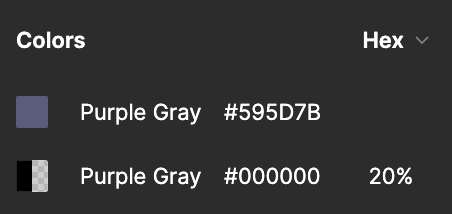
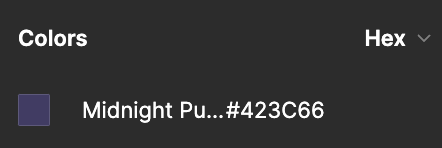
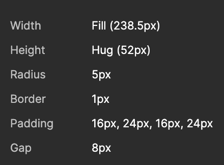

# Komentarz do zadania

Miałem parę zagwozdek związanych z designem podczas implementacji zadania, które w praktyce rozwiązałbym najprawdopodobniej poprzez kontakt z designerem, aby dopytać o szczegóły lub rozwiać wątpliwości, ale w tym przypadku pozostawię info dla jasności ponizej :)

1. Z jakiegoś powodu Figma wyświetlała mi czasem podwójny kolor "Purple gray", z tego co wywnioskowałem to jest to po prostu kolor "Midnight Purple", który chyba się jakoś "zbugował". W związku z czym w apce korzystałem w takich przypadkach z "Midnight Purple".
   
   

2. Gdy w Figmie nie było podanej nazwy zmiennej i kolor był użyty jednorazowo to wrzucałem go inline'owo. W praktyce pewnie skontaktowałbym się z designerem, żeby ustalić jego kontekst i jak mógłbym go wrzucić do theme'a.

3. Zauważyłem, że Figma źle liczy wysokość dla elementów, na przykładzie Cancel buttona

- Line height (20px)
- Padding (2x 16px)
- Border (2x 1px)

=> 54px, jednak Figma podaje 52px, w takich przypadkach po prostu to zostawiałem, w związku z czym w niektórych miejsach height może się różnić około 2px.

